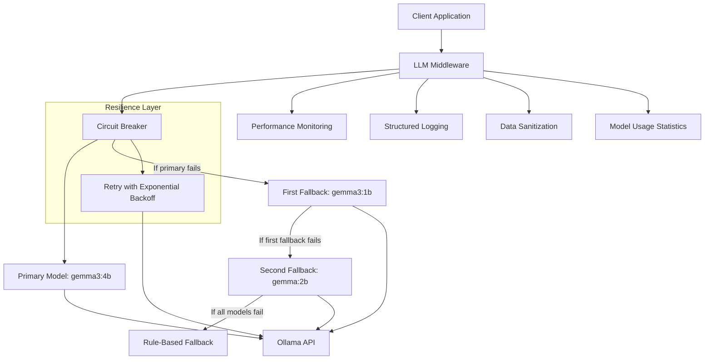

# LLM Middleware Application

A resilient middleware layer for interacting with Ollama's language models, designed to provide robust, production-ready access to LLMs by implementing various resilience patterns, monitoring capabilities, and fallback mechanisms.

## Key Features

- **Resilient API Interactions**: Circuit breakers and fallbacks to prevent cascading failures
- **Comprehensive Logging**: Structured logging with request tracking and context preservation
- **Performance Monitoring**: Latency tracking, token usage, and anomaly detection
- **Three-tier Model Fallback System**: Graceful degradation with rule-based final fallback
- **Model Attribution**: Clear indication of which model generated each response
- **High Load Simulation**: Intelligent model routing based on query complexity
- **Comprehensive Test Suite**: Controlled failure simulation for testing resilience

## Architecture

The application uses a tiered approach with three Ollama models:

1. **Primary Model**: `gemma3:4b` (largest and most capable)
2. **First Fallback Model**: `gemma3:1b` (medium-sized model)
3. **Second Fallback Model**: `gemma:2b` (smallest model)
4. **Rule-based Fallback**: Simple keyword-based responses when all models fail



## Setup Instructions

### Prerequisites

- Python 3.10 or higher
- Ollama with the Gemma models installed

### Installation

1. Clone the repository
2. Install dependencies:
   ```bash
   pip install -r requirements.txt
   ```
3. Set up environment variables:
   ```bash
   cp .env.template .env
   ```
4. If needed, modify the `.env` file to set your Ollama API URL (default is `http://localhost:11434`)

## Usage

### Basic Usage

```python
from middleware import LLMMiddleware

# Create middleware instance
middleware = LLMMiddleware()

# Process a prompt
response = middleware.process_request(
    "Explain the concept of circuit breakers in software architecture.",
    max_tokens=150,
    temperature=0.7
)

# Print the response
print(response["text"])
```

### Using Convenience Functions

```python
from app import process_prompt

# Process a prompt
response = process_prompt(
    "What is the capital of France?",
    max_tokens=50,
    temperature=0.5
)

# Print the response
print(response["text"])
```

### Testing with Special Parameters

```python
# Test with high load simulation
response = middleware.process_request(
    "List three common programming languages.",
    max_tokens=30,
    _simulate_high_load=True
)

# Test with forced fallbacks
response = middleware.process_request(
    "Explain quantum computing.",
    _test_force_first_fallback_fail=True
)

# Test with all models failing
response = middleware.process_request(
    "Tell me about artificial intelligence.",
    _test_force_all_models_fail=True
)
```

## Running the Test Suite

To run the test suite and verify that everything is working correctly:

```bash
python app.py
```

This will run a series of tests that demonstrate the various features of the application, including:
- Normal operation with the primary model
- Fallback to the first fallback model when the primary model fails
- Using the smallest model directly
- High load simulation
- Complete fallback chain (all models fail)
- Complex query with the primary model

## Package Structure

```
llm_middleware/
├── __init__.py                  # Package exports
├── app.py                       # Main entry point
├── middleware.py                # Core middleware class
├── main.py                      # Example usage and tests
├── ollama_client.py             # Ollama API client
├── models/                      # Data models
│   ├── __init__.py              
│   ├── request.py               # LLMRequest model
│   ├── response.py              # LLMResponse model
│   └── metrics.py               # PerformanceMetrics model
├── utils/                       # Utilities
│   ├── __init__.py              
│   ├── logging.py               # Logging setup and utilities
│   ├── serializers.py           # JSON serializers
│   └── text_utils.py            # Text sanitization
├── resilience/                  # Resilience patterns
│   ├── __init__.py              
│   ├── circuit_breaker.py       # Circuit breaker implementation
│   ├── retry.py                 # Retry mechanisms
│   └── fallbacks.py             # Fallback mechanisms
├── monitoring/                  # Performance monitoring
│   ├── __init__.py              
│   ├── performance.py           # Performance monitoring
│   ├── anomaly.py               # Anomaly detection
│   └── stats.py                 # Usage statistics tracking
└── api/                         # API interaction
    ├── __init__.py              
    └── llm_client.py            # LLM API interaction
```

## Troubleshooting

Common issues include:

- **Ollama not running**: Check if the Ollama server is active at the specified URL
- **Model not found**: Ensure the requested models are installed in Ollama
- **High latency**: Check system resources and Ollama performance
- **Frequent fallbacks**: May indicate issues with the primary model or Ollama service

## Extending the Application

### Adding a New Model

To add a new model to the fallback chain:

1. Update the fallback logic in `resilience/fallbacks.py`
2. Add the new model to the fallback chain
3. Update the high load simulation logic if needed

### Adding a New Feature

To add a new feature to the application:

1. Identify the appropriate module for the feature
2. Implement the feature in that module
3. Update the exports in the module's `__init__.py` file
4. Import and use the feature in the appropriate place
