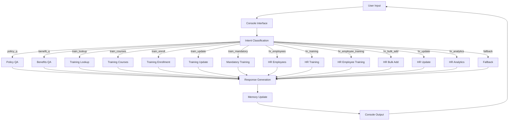
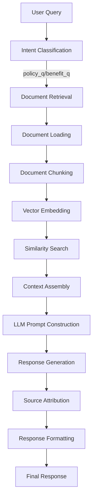
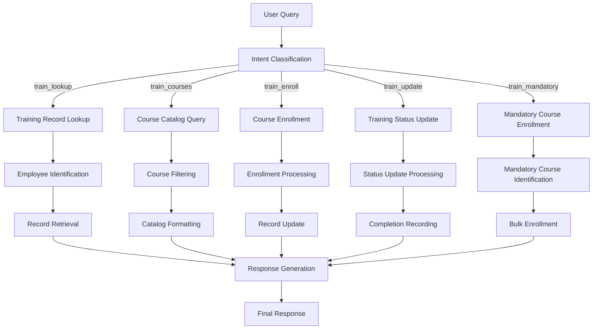
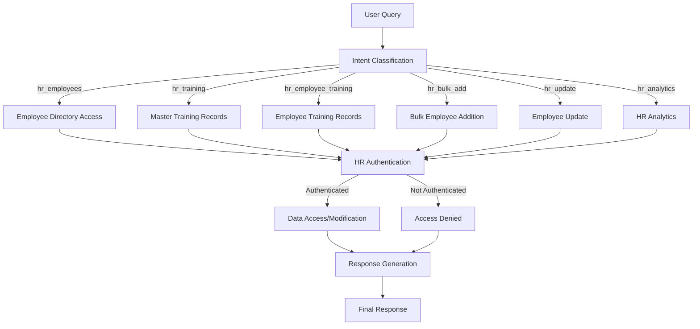
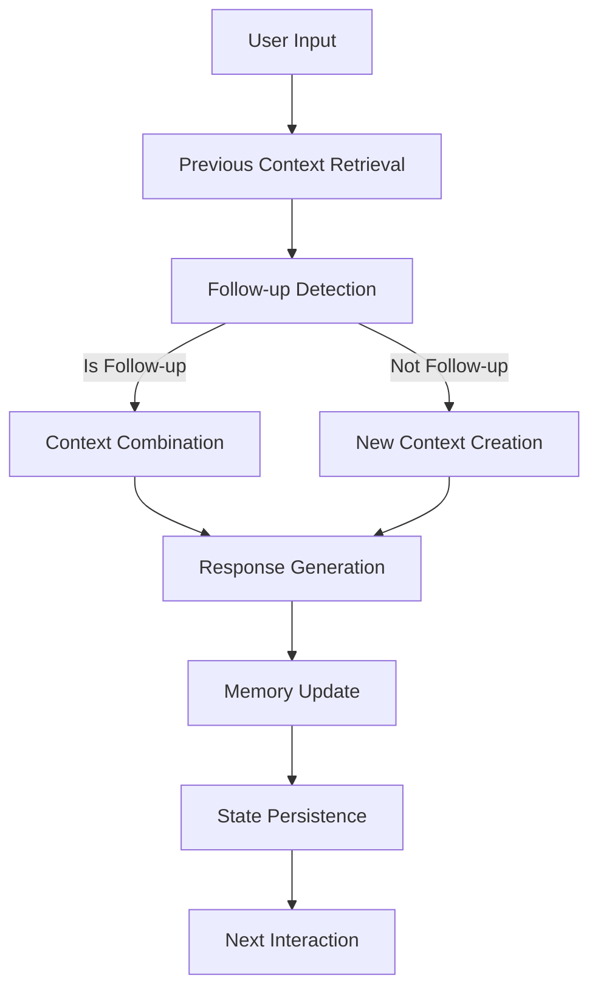

# Jenna HR Assistant - Technical Documentation


## Overview

Jenna is a comprehensive AI-powered HR assistant designed to provide employees and HR representatives with access to company policies, benefits information, training management, and employee data. The system uses natural language processing to understand user queries and provide relevant, context-aware responses.


## Core Capabilities

### 1. Policy and Benefits Information

Jenna can answer questions about a wide range of company policies and benefits, including:

- PTO and vacation policies
- Work hours and attendance
- Remote work arrangements
- Maternity/paternity leave
- Health insurance and retirement benefits
- Employee assistance programs
- Workplace safety and security
- Code of conduct and ethics
- Anti-discrimination and harassment policies

The system uses Retrieval-Augmented Generation (RAG) to find relevant information from the company's policy documents and generate accurate, contextual responses.


### 2. Training Management System

Jenna provides a comprehensive training management system that allows employees to:

- View their current training records and completion status
- See a catalog of available courses (both mandatory and elective)
- Enroll in new training courses
- Update their training completion status
- Check compliance with mandatory training requirements
- View upcoming training renewal dates


For HR representatives, additional capabilities include:

- View master training records for all employees
- Track company-wide training compliance
- View training status for specific employees
- Generate training analytics and reports


### 3. Employee Data Management

The system maintains a centralized employee database with:

- Basic employee information (ID, name)
- Department and role information
- Start date and tenure tracking
- Training record associations


HR representatives have special access to:

- View the complete employee directory
- Add new employees (individually or in bulk)
- Update existing employee information
- Generate employee analytics and reports


### 4. HR Analytics

Jenna provides HR representatives with powerful analytics capabilities:

- **Course Completion Analytics**:
  - Completion rates for specific courses
  - Identification of employees who haven't completed required training
  - Comparative analysis across different courses

- **Department Analytics**:
  - Employee distribution across departments
  - Department-specific training completion rates
  - Cross-departmental performance comparison

- **New Employee Analytics**:
  - Tracking of recent hires
  - Onboarding progress monitoring
  - Training enrollment status for new employees


### 5. Conversation Memory and Context Retention

Jenna maintains conversation context across interactions, enabling:

- Follow-up question handling
- Contextual responses based on previous exchanges
- Topic tracking throughout conversations
- Enhanced user experience with personalized interactions


### 6. Role-Based Access Control

The system implements a role-based access control system:

- Regular employees can only access their own information
- HR representatives (authenticated as Jane Doe, E002) can access sensitive company-wide data
- Authentication is required for accessing or modifying sensitive information


## User Interface Examples

### 1. Welcome Screen and User Authentication

```
╭───────────────────────────────────────────────────────────────────────────────── Jenna ─────────────────────────────────────────────────────────────────────────────────╮
│ Welcome to Jenna - Your AI HR Assistant!                                       │
│                                                                                │
│         I can help you with:                                                   │
│         • Company policies and benefits questions                              │
│         • Training record lookup and management                                │
│         • Course enrollment and completion updates                             │
│                                                                                │
│         Type 'help' for more information or 'exit' to quit.                    │
╰───────────────────────────────────────────────────────────────────────────────── AI HR Assistant ─────────────────────────────────────────────────────────────────────────────────╯
Please enter your name: Jane Doe
Please enter your employee ID: E002
╭───────────────────────────────────────────────────────────────────────────────── Welcome Back ─────────────────────────────────────────────────────────────────────────────────╮
│ Welcome back, Jane Doe!                                                        │
│                                                                                │
│         I'm Jenna, your AI HR Assistant. How can I help you today?             │
╰────────────────────────────────────────────────────────────────────────────────╯
```


### 2. Policy Question and Answer

```
You: What is our company's policy on remote work?

Intent classification completed in 0.542s
Policy QA completed in 1.231s

Jenna:
Based on our company's remote work policy, here are the key points:

## Remote Work Policy Overview

• Eligible employees can work from home up to 3 days per week with manager approval
• Remote work requests must be submitted at least 1 week in advance
• Employees must maintain regular working hours (9am-5pm) unless otherwise approved
• Employees are responsible for having a suitable home office setup including:
  - Reliable internet connection (minimum 50 Mbps)
  - Ergonomic workspace
  - Secure environment for company data
• All company security protocols must be followed while working remotely
• Performance expectations remain the same as in-office work
• Remote work privileges may be revoked if productivity decreases

For full details, please refer to the Employee Remote Work Policy document.

You: What equipment does the company provide for remote workers?

Intent classification completed in 0.489s
Policy QA completed in 0.987s

Jenna:
According to our remote work policy, the company provides the following equipment for remote workers:

## Company-Provided Equipment

• Laptop computer with necessary software
• Monitor (one standard 24" monitor)
• Keyboard and mouse
• Headset for video conferencing
• VPN access for secure connection
• Company phone (if required for job duties)

Employees are responsible for:
• Internet connection
• Desk and chair
• Proper lighting
• Any additional equipment beyond what is provided

If you need special accommodations or additional equipment, you should submit a request to your manager and IT department for approval.
```


### 3. Training Record Lookup

```
You: Show me my training record

Intent classification completed in 0.511s
Training lookup completed in 0.324s

Jenna:
Here's your current training record:

• HR-001: Workplace Ethics & Code of Conduct - Completed (Enrolled: 2024-10-15, 2024-11-05) - Due: 2025-11-05
• HR-002: Preventing Harassment & Discrimination - Not Started (Enrolled: 2024-11-05, Not completed) - Due: 2025-11-05
• SEC-010: Cyber-Security Awareness Basics - In Progress (Enrolled: 2024-11-01, Not completed) - Due: 2025-05-01
• SEC-230: Secure Coding for Python & TypeScript - Completed (Enrolled: 2025-01-05, 2025-01-20) - No due date
• LEAD-101: Technical Leadership Essentials - Not Started (Enrolled: 2025-02-01, Not completed) - No due date

A snapshot of your training record has been saved to data/training/snapshots\E002_20250429_130619.csv.

You: What courses are available for enrollment?

Intent classification completed in 0.478s
Training courses completed in 0.356s

Jenna:
## Available Courses

### Mandatory Courses:
• HR-001: Workplace Ethics & Code of Conduct (Required, 12-month renewal)
• HR-002: Preventing Harassment & Discrimination (Required, 12-month renewal)
• SEC-010: Cyber-Security Awareness Basics (Required, 6-month renewal)

### Elective Courses:
• AI-201: Introduction to Machine Learning (Elective)
• CLD-150: Cloud Infrastructure Fundamentals (Elective)
• DS-310: Data Science for Business Intelligence (Elective)
• LEAD-101: Technical Leadership Essentials (Elective)
• SEC-230: Secure Coding for Python & TypeScript (Elective)

To enroll in a course, type "Enroll me in [COURSE-ID]" (e.g., "Enroll me in AI-201").
```


### 4. HR Employee Directory Access

```
You: Show employee roster

Intent classification completed in 0.539s
HR employee directory access completed in 0.002s

Jenna:
## EMPLOYEE DIRECTORY

• E001: Alice Johnson - HR, HR Specialist (Started: 2024-01-15)
• E002: Jane Doe - HR, HR Specialist (Started: 2024-04-22)
• E003: Carlos Rodriguez - Marketing, Marketing Specialist (Started: 2024-05-10)
• E004: Dana Peterson - Engineering, QA Engineer (Started: 2024-02-28)
• E005: Evelyn Lee - Product, Product Manager (Started: 2023-08-12)
• E006: Frank Miller - Engineering, DevOps Engineer (Started: 2025-01-31)
• E007: Grace Kim - Engineering, Data Scientist (Started: 2024-06-01)
• E008: Henry Nguyen - Customer Support, Support Specialist (Started: 2024-09-20)
• E009: Isabella Garcia - Marketing, Content Creator (Started: 2025-01-31)
• E010: Jason Brown - Engineering, Software Engineer (Started: 2024-07-15)
• E011: Jeff Scott - Engineering, AI Engineer (Started: 2025-04-29)
• E012: Michael Johnson - Engineering, Data Engineer (Started: 2025-04-29)
• E013: Emily Williams - Marketing, Social Media Campaign Manager (Started: 2025-04-29)
• E014: Daniel Brown - IT, Cybersecurity Specialist (Started: 2025-04-29)
• E015: Sophia Martinez - HR, Training & Development Manager (Started: 2025-04-29)
• E016: Alexander Davis - Finance, Senior Accountant (Started: 2025-04-29)
• E017: Olivia Wilson - Customer Support, Client Success Representative (Started: 2025-04-29)
• E018: William Taylor - Product, Hardware Designer (Started: 2025-04-29)
• E019: Ava Thomas - Legal, General Counsel (Started: 2025-04-29)
• E020: James Anderson - Sales, Client Acquisition Representative (Started: 2025-04-29)
• E021: Emma Jackson - Research, Department Manager (Started: 2025-04-29)

This information is confidential and should only be accessed by HR personnel.
```


### 5. HR Analytics

```
You: How many people have completed the HR-001 course?

Intent classification completed in 0.752s
HR analytics completed in 0.621s

Jenna:
## HR-001 Course Completion Analysis

• Total Enrollments: 21
• Completed: 8 (38.1%)
• Not Completed: 13 (61.9%)

### Employees Who Haven't Completed HR-001:
• Carlos Rodriguez (E003): Not Started
• Frank Miller (E006): In Progress
• Isabella Garcia (E009): Not Started
• Michael Johnson (E012): Enrolled
• Emily Williams (E013): Enrolled
• Daniel Brown (E014): Enrolled
• Sophia Martinez (E015): Enrolled
• Alexander Davis (E016): Enrolled
• Olivia Wilson (E017): Enrolled
• William Taylor (E018): Enrolled
• Ava Thomas (E019): Enrolled
• James Anderson (E020): Enrolled
• Emma Jackson (E021): Enrolled

You: Show me department breakdown

Intent classification completed in 0.498s
HR analytics completed in 0.543s

Jenna:
## Department Analysis

Total Employees: 21

• Engineering: 6 employees (28.6%)
• HR: 3 employees (14.3%)
• Marketing: 3 employees (14.3%)
• Customer Support: 2 employees (9.5%)
• Product: 2 employees (9.5%)
• Finance: 1 employees (4.8%)
• IT: 1 employees (4.8%)
• Legal: 1 employees (4.8%)
• Research: 1 employees (4.8%)
• Sales: 1 employees (4.8%)

### Training Completion by Department

**Engineering**:
• Course Enrollments: 24
• Completed: 14 (58.3%)

**HR**:
• Course Enrollments: 12
• Completed: 5 (41.7%)

**Marketing**:
• Course Enrollments: 12
• Completed: 3 (25.0%)

**Product**:
• Course Enrollments: 8
• Completed: 5 (62.5%)

**Customer Support**:
• Course Enrollments: 8
• Completed: 3 (37.5%)
```


### 6. Employee Update

```
You: Update employee E021 role to Department Manager

Intent classification completed in 0.612s
HR employee update completed in 0.487s

Jenna:
## EMPLOYEE UPDATE SUCCESSFUL

Successfully updated employee E021.

### Updated Information:
• Employee ID: E021
• Name: Emma Jackson
• Department: Research
• Role: Department Manager
• Start Date: 2025-04-29
```


### 7. Bulk Employee Addition

```
You: Add these employees: E022 Robert Chen Engineering Software Engineer, E023 Sarah Kim Marketing Content Strategist

Intent classification completed in 0.587s
HR bulk employee addition completed in 0.723s

Jenna:
## BULK EMPLOYEE ADDITION SUCCESSFUL

Successfully added 2 out of 2 employees.

### Successfully Added:
• E022: Robert Chen
• E023: Sarah Kim

## MANDATORY TRAINING ENROLLMENT

### Robert Chen (E022):
• Enrolled in HR-001
• Enrolled in HR-002
• Enrolled in SEC-010

### Sarah Kim (E023):
• Enrolled in HR-001
• Enrolled in HR-002
• Enrolled in SEC-010
```


### 8. Benefits Question

```
You: What mental health resources are available to employees?

Intent classification completed in 0.521s
Benefits QA completed in 1.105s

Jenna:
Our company offers several mental health resources as part of our Employee Assistance Program (EAP) and wellness benefits:

## Mental Health Resources

### Employee Assistance Program (EAP)
• Free, confidential counseling services (up to 8 sessions per issue per year)
• 24/7 crisis hotline: 1-800-555-EAP1
• Access to licensed therapists and mental health professionals
• Support for issues including stress, anxiety, depression, grief, and work-life balance
• Option for virtual/telehealth or in-person sessions

### Additional Mental Health Benefits
• Mental health coverage through company health insurance
  - In-network providers require only a $25 copay
  - Out-of-network reimbursement available at 70%
• Mindfulness and meditation app subscription (Calm or Headspace)
• Quarterly wellness workshops focusing on mental health topics
• Mental health days (2 dedicated days per year, separate from sick leave)
• Stress management resources and training

### Accessing Services
To access EAP services, you can:
1. Call the EAP hotline: 1-800-555-EAP1
2. Visit the EAP portal: company.eap-provider.com
3. Contact HR for confidential assistance

All services are completely confidential, and your privacy is protected by law.
```


## Technical Architecture

### Technologies Used

1. **Language Models**:
   - Ollama with the Gemma3 model for natural language understanding and generation
   - LangChain for RAG components and prompt engineering
   - LangGraph for workflow orchestration and state management

2. **Vector Database**:
   - FAISS for document embeddings and similarity search
   - Custom document chunking and indexing for optimal retrieval

3. **Data Storage**:
   - CSV-based storage for employee and training records
   - File-based storage for policy and benefits documents
   - Snapshot system for training record history

4. **Python Libraries**:
   - Pandas for data manipulation and analysis
   - Pydantic for data validation and modeling
   - Rich for enhanced console formatting and display

5. **Development Tools**:
   - Logging system for debugging and performance tracking
   - Visualization tools for memory and conversation analysis
   - Testing framework for component validation


### System Components

1. **Intent Classification System**:
   - Analyzes user queries to determine the appropriate handler
   - Routes requests to specialized processing nodes
   - Extracts structured arguments from natural language

2. **RAG System**:
   - Document loaders with encoding detection
   - Chunking strategies optimized for policy documents
   - Vector-based retrieval with metadata filtering
   - Context-aware response generation

3. **Orchestration Graph**:
   - State-based workflow management
   - Conditional routing based on intent classification
   - Dependency injection for component integration
   - Terminal state handling for conversation flow

4. **Memory System**:
   - Conversation history tracking
   - Follow-up question detection
   - Context retention between interactions
   - Entity tracking across conversations

5. **Console Interface**:
   - Rich text formatting for enhanced readability
   - Structured output with proper spacing and indentation
   - Special handling for bullet points and headings
   - Session management with graceful conversation ending


## File and Folder Structure

```
jenna-hr-assistant/
│
├── main.py                      # Main application entry point
├── README.md                    # Project documentation
├── requirements.txt             # Python dependencies
│
├── data/                        # Data storage directory
│   ├── employees.csv            # Employee database
│   ├── benefits/                # Benefits documents
│   │   └── [benefit policy files]
│   ├── policies/                # Policy documents
│   │   └── [policy files]
│   ├── training/                # Training data
│   │   ├── courses.csv          # Course catalog
│   │   ├── master.csv           # Master training records
│   │   └── training_records.csv # Detailed training records
│   └── vector_store/            # Vector embeddings for documents
│
├── src/                         # Source code
│   ├── __init__.py
│   ├── console/                 # Console interface
│   │   ├── __init__.py
│   │   └── interface.py         # Console UI implementation
│   │
│   ├── employee/                # Employee management
│   │   ├── __init__.py
│   │   └── employee_info.py     # Employee data models and operations
│   │
│   ├── intent/                  # Intent classification
│   │   ├── __init__.py
│   │   └── router.py            # Intent classification and routing
│   │
│   ├── orchestration/           # Workflow orchestration
│   │   ├── __init__.py
│   │   ├── graph.py             # LangGraph workflow definition
│   │   ├── memory.py            # Conversation memory system
│   │   ├── state.py             # State management
│   │   ├── utils.py             # Utility functions
│   │   └── nodes/               # Processing nodes
│   │       ├── __init__.py
│   │       ├── classification_nodes.py
│   │       ├── policy_nodes.py
│   │       ├── benefits_nodes.py
│   │       ├── training_nodes.py
│   │       ├── hr_nodes.py
│   │       └── utility_nodes.py
│   │
│   ├── rag/                     # Retrieval-Augmented Generation
│   │   ├── __init__.py
│   │   ├── document_loader.py   # Document loading and processing
│   │   ├── policy_qa.py         # Policy question answering
│   │   └── benefits_qa.py       # Benefits question answering
│   │
│   └── training/                # Training management
│       ├── __init__.py
│       └── csv_tools.py         # Training record operations
│
├── tests/                       # Test suite
│   ├── __init__.py
│   ├── test_intent.py
│   ├── test_orchestration.py
│   ├── test_rag.py
│   └── test_training.py
│
├── logs/                        # Log files
│   ├── conversation_*.log       # Conversation logs
│   ├── query_processing_*.log   # Query processing logs
│   └── retrieval_*.log          # Retrieval logs
│
├── reference_docs/              # Reference documentation
│   ├── knowledge_transfer.md    # Technical knowledge transfer
│   └── prd.md                   # Product requirements
│
└── visualization/               # Visualization outputs
    ├── query_analysis.png
    └── retrieval_metrics.png
```


## Workflow and Pipeline Diagrams

### Main Application Workflow




### RAG System Pipeline




### Training Management Pipeline




### HR Data Management Pipeline




### Memory System Pipeline




## Data Flow

1. User inputs a query through the console interface
2. The intent classification system analyzes the query and determines the appropriate handler
3. The query is routed to the relevant processing node (policy, benefits, training, etc.)
4. If needed, the RAG system retrieves relevant documents or the database system accesses employee/training records
5. The response is generated based on the retrieved information and conversation context
6. The memory system updates with the new interaction
7. The formatted response is displayed to the user through the console interface


## Security and Privacy

- Role-based access control for sensitive information
- Authentication required for HR representative functions
- Logging system that captures interactions without storing sensitive data
- Clear separation between general policy information and employee-specific data


## Extensibility

The system is designed for easy extension with:

- Modular architecture that separates concerns
- Well-defined interfaces between components
- Comprehensive documentation for future developers
- Standardized data formats for interoperability


## Performance Considerations

- Optimized document retrieval for fast response times
- Efficient data storage and access patterns
- Caching mechanisms for frequently accessed information
- Asynchronous processing where appropriate


## Future Enhancement Opportunities

- Web interface for improved accessibility
- Integration with external HR systems
- Enhanced analytics with visualization capabilities
- Mobile application support
- Multi-language support for international organizations
- Advanced document processing for automatic policy updates
