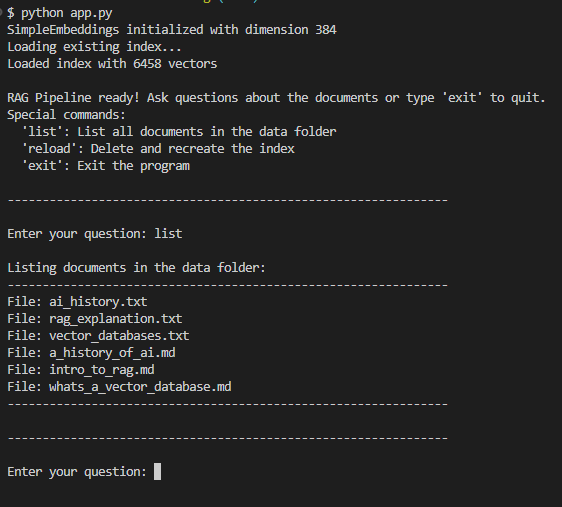
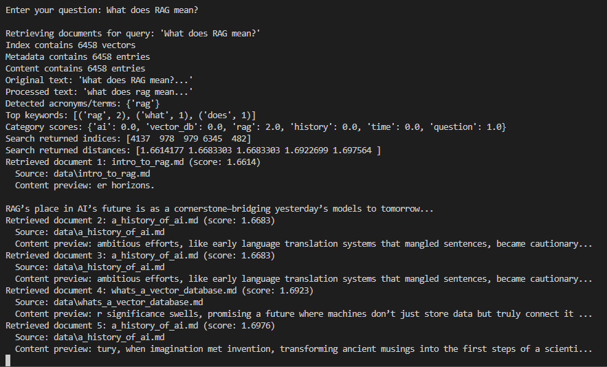
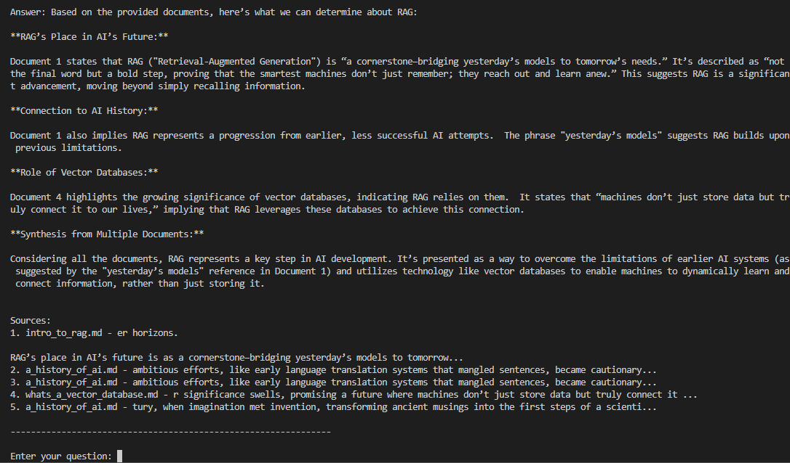

# RAG Application Interface Guide

This guide provides an overview of the RAG application interface, its commands, and how to use it effectively.

## Application Interface and Commands

The RAG application runs in the console and provides an interactive interface for querying your document collection. When you start the application, it will load or create a FAISS index of your documents and then present you with a prompt to enter questions.

The application supports several special commands:

- **list**: Lists all documents in the data folder, showing you what content is available for querying.
- **reload**: Deletes and recreates the FAISS index (useful when you make changes to your implementation).
- **exit**: Exits the program and returns to the command line.

**## Asking Questions and Viewing Responses**

To query your document collection, simply type your question at the prompt and press Enter. The system will convert your question into an embedding vector, search for similar document chunks, and generate a response using the retrieved context.

After processing your query, the application will display:

1. The generated answer based on the retrieved documents.
2. A list of sources used to generate the answer, including document titles, content previews, and relevance scores.

This information helps you understand not just the answer itself, but also where the information came from.

## Tips for Effective Use

- Use the **list** command to familiarize yourself with available documents before asking questions.
- If you make changes to your implementation or your data, use the **reload** command to rebuild the index.
- Ask specific questions that are likely to be answered by the content in your documents.
- Examine the source information to understand where answers are coming from.
- Pay attention to relevance scores to gauge the confidence in the retrieved documents.