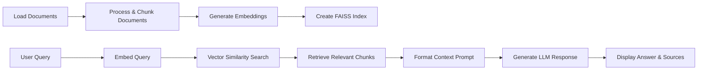

# RAG Implementation Reference Guide

This document provides additional technical details, explanations, and reference material for the RAG implementation activity. It's designed to supplement the main activity instructions with deeper insights into how the system works.


## Understanding Console Debug Output

When you run a query, the system prints diagnostic information that helps you understand how retrieval works:

1. **Query Information**:
   ```
   Retrieving documents for query: '[your question]'
   Index contains [number] vectors
   Metadata contains [number] entries
   Content contains [number] entries
   ```
   This confirms what the system is searching for and verifies the index size is consistent.

2. **Search Results**:
   ```
   Search returned indices: [array of indices]
   Search returned distances: [array of distance scores]
   ```
   These are the raw FAISS results:
   - Indices: Positions in the vector database where matches were found
   - Distances: Similarity scores (smaller numbers = better matches)

3. **Retrieved Documents Details**:
   ```
   Retrieved document 1: [title] (score: [distance score])
     Source: [file path]
     Content preview: [first 100 characters of content]...
   ```
   For each matched document:
   - Which document was retrieved and its relevance score
   - Where the document came from (file path)
   - A preview of the content that will be used in the answer

This information is valuable for understanding:
- How semantic search works under the hood
- The relationship between vector similarity (distances) and content relevance
- How the system identifies and ranks potentially relevant information


## Troubleshooting

### Common Issues

1. **Ollama Connection Problems**
   - Ensure Ollama is running with `ollama run gemma3:4b`
   - Check that the OLLAMA_API_URL in .env is correct (default: http://localhost:11434)
   - Verify network connectivity to the Ollama service

2. **Embedding Generation**
   - The SimpleEmbeddings class uses a deterministic approach to generate embeddings
   - This ensures that the same text always gets the same embedding vector
   - The approach is fast and doesn't require downloading any models

3. **FAISS Index Issues**
   - Ensure the dimension of query embeddings matches document embeddings
   - Check that the index is properly initialized before adding vectors
   - Verify that the index is saved and loaded correctly


## Code Structure and Component Interaction

The RAG pipeline implementation consists of several interacting components that form a complete system:

1. **RAGPipeline Class** (app.py):
   - Core orchestration class that manages the entire pipeline workflow
   - Handles document loading, processing, indexing, retrieval, and response generation
   - Maintains the state of the system including the FAISS index and document metadata

2. **Document Utilities** (document_utils.py):
   - Provides the Document class that associates content with metadata
   - Implements text splitting logic that respects content boundaries
   - Manages chunking with appropriate overlap to preserve context

3. **Embedding Generation** (simple_embeddings.py):
   - Implements the SimpleEmbeddings class for deterministic vector generation
   - Converts text into numerical representations that capture semantic meaning
   - Enables similarity comparison between documents and queries

4. **LLM Integration** (ollama_client.py):
   - Provides a client for communicating with the Ollama LLM service
   - Handles prompt formatting and response generation
   - Manages API communication with the local LLM

The workflow between these components follows a clear sequence:
1. Documents are loaded and processed into appropriate chunks
2. Each chunk is converted to vector embeddings and stored in FAISS
3. User queries are embedded using the same technique
4. FAISS finds the most similar document chunks based on vector similarity
5. Retrieved chunks are formatted into a context prompt
6. The LLM generates a response based on the context and query


## RAG Pipeline Workflow



This diagram illustrates the complete data flow through your RAG implementation, from document processing to response generation.


## Understanding the Utility Components

This activity allows you to focus on implementing the core RAG pipeline while using some utility components that are already provided. Here's a brief overview of these components:

### SimpleEmbeddings Class

The `SimpleEmbeddings` class provides a deterministic approach to generating embeddings without requiring external models:

1. **Advanced Text Preprocessing**
   - Preserves acronyms and technical terms before lowercasing
   - Handles hyphenated terms and compound phrases
   - Creates multiple text representations for different matching strategies

2. **Semantic-Aware Embedding Generation**
   - Uses keyword frequency with domain-specific vocabularies
   - Implements category-based weighting (AI terms, vector database terms, etc.)
   - Applies multi-strategy keyword matching for better semantic understanding

3. **Debugging and Transparency**
   - Provides detailed output about detected terms and keywords
   - Shows category scores to explain why certain documents match
   - Helps you understand the embedding process


### Document Utilities

The `document_utils.py` module handles document representation and chunking:

1. **Document Class**
   - Simple container for text content and metadata
   - Replaces more complex document representations from libraries like LangChain

2. **Text Splitting Functions**
   - `split_text()`: Intelligently splits text using multiple separators
   - Respects natural boundaries like paragraphs and sentences
   - Implements overlap to maintain context between chunks

3. **Document Chunking**
   - `split_documents()`: Splits documents while preserving metadata
   - Adds chunk index to metadata for tracking
   - Ensures consistent chunking across different document types
