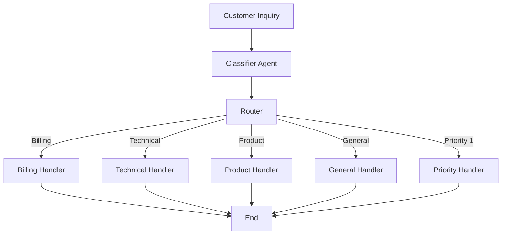

# Customer Service Multi-Agent Workflow System: Knowledge Transfer

## System Overview

This document provides a comprehensive overview of the current state of the Customer Service Multi-Agent Workflow System, which processes customer inquiries through a series of specialized agents using LangGraph and Ollama. The system now features an interactive AI Customer Support Representative named Emma G. who provides personalized responses based on optional user information.

## System Architecture

The application implements a multi-agent workflow system for customer service inquiries. It processes customer messages through a series of specialized agents that classify, route, and respond to different types of inquiries.



## Key Components

1. **OllamaClient** (`ollama_client.py`):
   - A client for interacting with the Ollama API
   - Handles text generation and embeddings
   - Includes error handling and health checking

2. **State Management**:
   - Uses TypedDict for strongly typed state management
   - `Message` type for customer inquiries with content, type, priority, and status
   - `AgentState` for tracking messages, current message, and history

3. **Agent Nodes**:
   - **Classifier**: Analyzes incoming messages and assigns type and priority
   - **Router**: Directs messages to appropriate handlers based on classification
   - **Specialized Handlers**:
     - Billing Handler
     - Technical Handler
     - Product Handler
     - General Handler
     - Priority Handler (for urgent inquiries)

4. **Workflow Graph**:
   - Built using LangGraph's StateGraph
   - Implements a directed graph with conditional routing
   - Processes messages sequentially through appropriate handlers

## Workflow Pipeline Analysis

The system contains one main workflow pipeline with five distinct routing paths that a customer inquiry can follow based on classification:

1. **Billing Path**: Classification → Router → Billing Handler → END
2. **Technical Path**: Classification → Router → Technical Handler → END
3. **Product Path**: Classification → Router → Product Handler → END
4. **General Path**: Classification → Router → General Handler → END
5. **Priority Path**: Classification → Router → Priority Handler → END

The system creates a single workflow graph using LangGraph's StateGraph, and then dynamically routes each customer inquiry through one of these five paths based on the message classification and priority. All messages first go through the classification stage, then through the router, and finally to one of the specialized handlers before reaching the end.

This design pattern follows a single-pipeline architecture with conditional branching rather than multiple separate pipelines.

## Message Handling Process

Messages in the system are created and handled as follows:

### Message Structure

The system defines a `Message` TypedDict to structure customer inquiries:

```python
class Message(TypedDict):
    content: str
    type: Optional[str]
    priority: Optional[int]
    status: Optional[str]
    user_name: Optional[str]
    user_email: Optional[str]
    additional_context: Optional[str]
```

Each message has:
- `content`: The actual text of the customer inquiry
- `type`: Classification (billing, technical, product, general)
- `priority`: Urgency level (1-4)
- `status`: Processing state ("new", "classified", "resolved", etc.)
- `user_name`: Optional name of the customer for personalized responses
- `user_email`: Optional email address for follow-up
- `additional_context`: Optional additional details about the customer's situation

### Message Creation

In the current implementation, messages are created when the `process_inquiry()` function is called:

```python
def process_inquiry(
    message_content: str,
    user_name: str = None,
    user_email: str = None,
    additional_context: str = None,
) -> Dict:
    # ...
    initial_state = AgentState(
        messages=[HumanMessage(content=message_content)],
        current_message={
            "content": message_content,
            "type": None,
            "priority": None,
            "status": "new",
            "user_name": user_name,
            "user_email": user_email,
            "additional_context": additional_context,
        },
        history=[],
    )
    # ...
```

The system also includes a `parse_user_input()` function that extracts optional user information from the input text:

```python
def parse_user_input(input_text):
    """Extract inquiry content and optional user information."""
    # Default values
    inquiry = input_text
    name = None
    email = None
    context = None

    # Look for optional format with square brackets
    bracket_match = re.search(r"(.*?)(?:\[(.*?)\])?$", input_text)
    if bracket_match and bracket_match.group(2):
        inquiry = bracket_match.group(1).strip()
        info_text = bracket_match.group(2).strip()

        # Extract name if provided
        name_match = re.search(r"Name:\s*(.*?)(?:,|$)", info_text)
        if name_match:
            name = name_match.group(1).strip()

        # Extract email if provided
        email_match = re.search(r"Email:\s*(.*?)(?:,|$)", info_text)
        if email_match:
            email = email_match.group(1).strip()

        # Extract additional context if provided
        context_match = re.search(r"Context:\s*(.*?)(?:,|$)", info_text)
        if context_match:
            context = context_match.group(1).strip()

    return {
        "inquiry": inquiry,
        "name": name,
        "email": email,
        "additional_context": context,
    }
```

Users can include optional information in their inquiries using the format:
```
My inquiry text [Name: John Doe, Email: john@example.com, Context: Additional details]
```

### Message Lifecycle

Once created, a message goes through several stages:

1. **Classification**: The classifier agent adds `type` and `priority` and updates status to "classified"
2. **Routing**: The router examines the message type and priority to determine which handler to use
3. **Handling**: The specialized handler processes the message and:
   - Updates status to "resolved" (or "resolved_urgent")
   - Adds the message to history
   - Generates a response (as an `AIMessage`) that's added to the messages list

### Response Messages

Response messages are created by the handlers and added to the state:

```python
# Ensure the response has Emma's signature if it's missing
if "Emma G." not in response_str:
    response_str += (
        "\n\nEmma G.\nAI Customer Support Representative\nSaaS Solutions Inc."
    )

state["messages"].append(AIMessage(content=response_str))
```

These are LangChain `AIMessage` objects that contain the generated responses from the LLM. All responses are signed by "Emma G., AI Customer Support Representative" and include personalized greetings and context acknowledgments when user information is provided.

#### Personalization Features

The system personalizes responses in several ways:

1. **Personalized Greetings**: When a user provides their name, responses begin with a greeting that includes their name.
   ```
   Hello John, 
   ```

2. **Context Acknowledgment**: When additional context is provided, the response acknowledges this information.
   ```
   Based on the additional context you provided (Pro plan, Account #12345), 
   ```

3. **Consistent Signature**: All responses are signed by Emma G., ensuring a consistent brand identity.
   ```
   Emma G.
   AI Customer Support Representative
   SaaS Solutions Inc.
   ```

## LLM Integration (Ollama/Gemma 3)

The application fully integrates with Ollama and specifically uses Gemma 3 as its default LLM:

### Ollama Client Initialization

```python
# Load environment variables
load_dotenv()
OLLAMA_API_URL = os.getenv("OLLAMA_API_URL")

# Initialize Ollama client
ollama_client = OllamaClient(OLLAMA_API_URL)
```

### OllamaClient Class

The `ollama_client.py` file contains a dedicated client for interacting with Ollama:

```python
class OllamaClient:
    def __init__(self, api_url: Optional[str] = None, model: str = "gemma3:4b"):
        # ...
        self.model = model
```

Note that it specifically uses "gemma3:4b" as the default model, which is Gemma 3 with 4 billion parameters.

### LLM Usage Throughout the Application

The application leverages Ollama in multiple places:

1. **For Message Classification**:
   ```python
   ollama_response = ollama_client.generate(classification_prompt)
   response_str = ollama_response["response"]
   ```

2. **For Response Generation** in each specialized handler:
   ```python
   ollama_response = ollama_client.generate(response_prompt)
   response_str = ollama_response["response"]
   ```

### Error Handling

The client includes robust error handling for Ollama API issues, including health checks and user-friendly error messages.

## Enhanced Classifier

The system includes an enhanced classifier with robust JSON extraction capabilities:

### JSON Extraction

The classifier uses a multi-strategy approach to extract JSON from LLM responses:

```python
def extract_json_from_text(text):
    """Extract JSON from text that might contain markdown or explanatory content."""
    # Try direct JSON parsing first
    try:
        return json.loads(text)
    except json.JSONDecodeError:
        pass

    # Look for JSON in code blocks
    code_block_pattern = r"```(?:json)?\s*([\s\S]*?)\s*```"
    code_blocks = re.findall(code_block_pattern, text)
    if code_blocks:
        for block in code_blocks:
            try:
                return json.loads(block)
            except json.JSONDecodeError:
                continue

    # Look for JSON-like patterns
    json_pattern = r"\{[^}]*\"type\"[^}]*\"priority\"[^}]*\}"
    json_matches = re.findall(json_pattern, text)
    if json_matches:
        for match in json_matches:
            try:
                return json.loads(match)
            except json.JSONDecodeError:
                continue

    # If all else fails, try to construct JSON from the text
    type_match = re.search(r"type[\"']?\s*:\s*[\"'](\w+)[\"']", text, re.IGNORECASE)
    priority_match = re.search(r"priority[\"']?\s*:\s*(\d+)", text, re.IGNORECASE)
    
    if type_match or priority_match:
        result = {}
        if type_match:
            result["type"] = type_match.group(1).lower()
        if priority_match:
            result["priority"] = int(priority_match.group(1))
        return result
    
    return None
```

This approach ensures that the classifier can handle various response formats from the LLM, including:
- Clean JSON responses
- JSON embedded in markdown code blocks
- Responses with explanatory text around the JSON
- Responses that mention the classification without proper JSON formatting

### Improved Prompt Engineering

The classifier also uses improved prompt engineering to encourage the LLM to return properly formatted JSON:

```python
classification_prompt = f"""
Analyze the following customer service inquiry and classify it:

Customer message: {content}

Determine:
1. Type (select one): billing, technical, product, general
2. Priority (select one): 1 (urgent), 2 (high), 3 (medium), 4 (low)

Respond with a JSON object with 'type' and 'priority' fields.
Format your response as a valid JSON object like this example:
{{
  "type": "billing",
  "priority": 2
}}

Do not include any explanations or additional text, just the JSON object.
"""
```

These enhancements significantly improve the reliability of the classification process, ensuring that customer inquiries are properly routed to the appropriate specialized handlers.

## Current Features

1. **Interactive User Interface**: The system now features a fully interactive console interface that allows users to input inquiries and receive responses in real-time.

2. **Personalized Responses**: Responses are personalized based on user-provided information, including name, email, and additional context.

3. **AI Customer Support Representative**: All responses come from Emma G., providing a consistent identity for the AI assistant.

4. **Optional User Information**: Users can optionally provide their name, email, and additional context for more personalized service.

5. **Demo Mode**: The system includes a demonstration mode that showcases various inquiry types with sample user information.

## Current Limitations

1. **Single-Turn Conversations**: The system processes each message independently and doesn't maintain conversation context between inquiries.

2. **No Persistence**: Customer inquiries and responses are not stored persistently between application runs.

## Potential Enhancements

1. **Multi-Turn Conversations**: Implement conversation history to allow for follow-up questions and more natural interactions.

2. **Database Integration**: Store messages and responses in a database for persistence and analytics.

3. **User Authentication**: Add user authentication to automatically retrieve user information without requiring it in each inquiry.

4. **Email Integration**: Add functionality to send follow-up emails to users who provide their email addresses.

## Configuration & Setup

- Uses environment variables for Ollama API configuration
- Requires a running Ollama instance (default: http://localhost:11434)
- Uses the Gemma3:4b model by default

## Development Structure

The application has been refactored into a modular structure for improved maintainability:

```
project/
├── models/          # Data models
│   └── state.py     # Message and AgentState TypedDict definitions
├── agents/          # Classification and routing logic
│   ├── classifier.py # Message classification
│   ├── router.py    # Message routing
│   └── handlers/    # Specialized inquiry handlers
│       ├── billing.py
│       ├── technical.py
│       ├── product.py
│       ├── general.py
│       └── priority.py
├── knowledge/       # Knowledge base functionality
│   └── knowledge_base.py
├── ui/              # User interface components
│   ├── console.py   # Interactive console interface
│   └── demo.py      # Demo functionality
├── utils/           # Utility functions
│   └── input_parser.py # User input parsing
├── workflow.py      # Workflow graph creation and execution
├── app.py           # Main entry point (now much smaller)
├── ollama_client.py # Client for Ollama API
├── .env.template    # Template for environment configuration
└── requirements.txt # Dependencies
```

This modular structure provides several benefits:
- Each file has a single responsibility
- Dependencies are explicitly injected
- Code is more testable and easier to modify
- New handlers or features can be added without modifying core files

## Test Scenarios

The system includes a comprehensive set of test scenarios to evaluate its functionality:

### Test Scenarios Document

A dedicated `test-scenarios.md` file in the `reference_docs/_assets/` directory provides five distinct test scenarios for evaluating the Customer Service Inquiry System. Each scenario is designed to test different aspects of the system based on the context data available in SaaS Solutions Inc.'s knowledge base.

The test scenarios cover:

1. **Billing Inquiry - Double Charge Issue**: Tests handling of refund requests and billing policies
2. **Technical Support - Account Lockout**: Tests account security procedures and 2FA troubleshooting
3. **Product Inquiry - Tier Comparison**: Tests product knowledge and tier-specific information
4. **General Inquiry - Finding Documentation**: Tests knowledge of documentation resources
5. **Priority/Emergency - Data Loss Issue**: Tests urgent issue handling and escalation procedures

Each scenario includes:
- The exact text to input, including user information in brackets
- Expected behavior criteria for evaluating responses
- Specific elements to look for in each response

These test scenarios help ensure that the system correctly classifies, routes, and responds to different types of customer inquiries while properly incorporating personalization features.

## User Interface

The application provides a simple console interface with the following commands:

- `exit`: Quit the application
- `help`: Display help information
- `clear`: Clear the screen
- `demo`: Run a demonstration with example inquiries

Users can enter inquiries directly or include optional information in brackets:

```
Enter your inquiry (or command): I need to upgrade my plan [Name: John, Email: john@example.com, Context: Currently on Basic plan]
```

This knowledge transfer document provides a comprehensive overview of the current state of the Customer Service Multi-Agent Workflow System, its architecture, components, and potential areas for enhancement.
